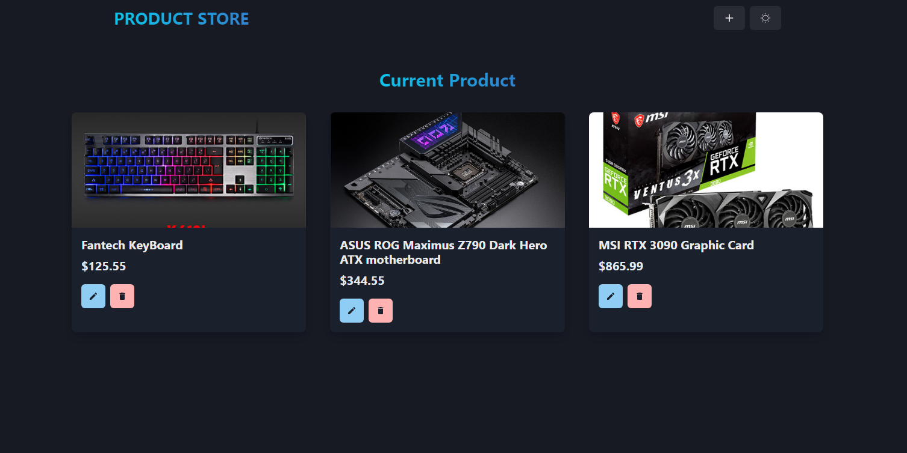

---
# Product Store MERN Web Application

## Introduction

Welcome to the [MERN Product Page!](https://mern-product-store-5gaw.onrender.com/) This simple web application is built using the MERN stack (MongoDB, Express, React, and Node.js). It allows users to view and manage product details with a clean and efficient design.



## Prerequisites

Before starting, ensure you have the following prerequisites installed and set up:

- Node.js and npm installed on your machine
- MongoDB database (either locally or using a service like MongoDB Atlas)
- Environment Variables configured in a .env file

## Getting Started

1. Clone the repository:

   ```
   git clone https://github.com/Dulshan330/taskbun.git
   cd MERN_Product_Store
   ```
2. Install dependencies:

   ```
   npm run build
   ```
  3. Set up MongoDB and Environment Variables:
  - Create a .env file in the root of your project and add the following variables:
    ```
    MONGO_URI=your_mongo_db_url
    PORT=your_port_number
    ```
4. Start the development server:

   ```
   npm run start
   ```
   This will start the Node.js server. You can access the product page by navigating to http://localhost:5000.

## Usage
Once the application is running, users can view a list of products and manage them. MongoDB stores all product data securely.

## Contributing
We welcome contributions to the MERN Product Page! Whether it's bug fixes, feature suggestions, or code contributions, feel free to open issues or submit pull requests.

## Author
Dulshan Senadheera

---
